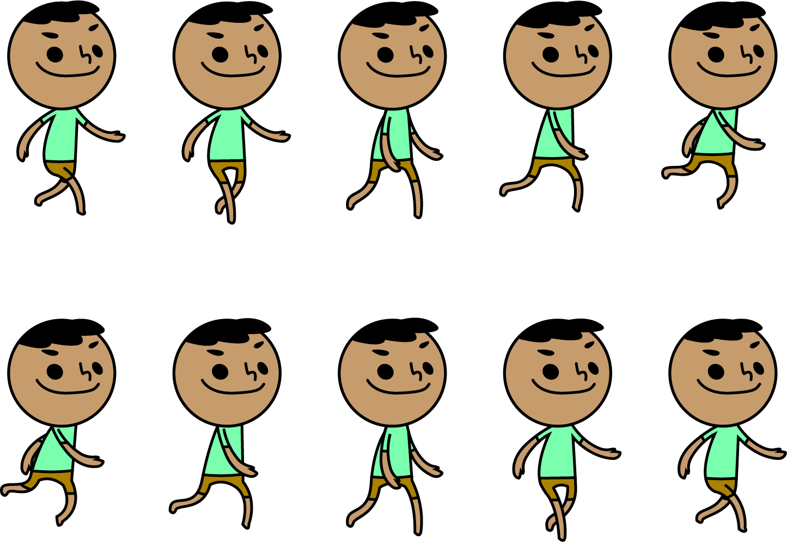

# BroccoliMari

## Coding Challenge for Workinman

### Table of contents
* [General info](#general-info)
* [Documentation](#documentation)
* [Technologies](#technologies)

### General info
This is a game I created for Workinman. It is a parody of Katamari Damacy. Players collects as many broccolis as possible while dodging obstacles with WASD controls.

### Documentation
I have brainstormed and wrote down my work process here :
https://docs.google.com/document/d/1QdFa_M9WFgHSgCkUfGPSt_2jMkTu5gMU8_jCqat1LqU/edit?usp=sharing

### Technologies
This project is created with Unity 2020.3.36f1.git.master.7469419 Personal
Visual and Audio effects : Kid Sprite (made myself with Illustrator a few years back), Broccoli and Obstacles (Google Image), Audio files (royalty free sound bites)
